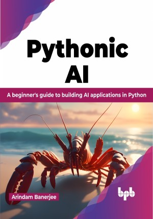

# Pythonic AI

Unlock the power of AI with Python: Your Journey from Novice to Neural Nets

This is the repository for [Pythonic AI
](https://bpbonline.com/products/pythonic-ai?variant=42976370720968),published by BPB Publications.

## About the Book
“Pythonic AI” is a book that teaches you how to build AI models using Python. It also includes practical projects in different domains so you can see how AI is used in the real world.

Besides teaching how to build AI models, the book also teaches how to understand and explore the opportunities that AI presents. It includes several hands-on projects that walk you through successful AI applications, explaining concepts like neural networks, computer vision, natural language processing (NLP), and generative models. Each project in the book also reiterates and reinforces the important aspects of Python scripting. You'll learn Python coding and how it can be used to build cutting-edge AI applications. The author explains each essential line of Python code in detail, taking into account the importance and difficulty of understanding.

By the end of the book, you will learn how to develop a portfolio of AI projects that will help you land your dream job in AI.

## What You Will Learn
•  Create neural network models using the TensorFlow 2 library.

•  Develop Convolutional Neural Networks (CNNs) for computer vision tasks.

•  Develop Sequence models for Natural Language Processing (NLP) tasks.

•  Create Attention-based and Transformer models.

•  Learn how to create Generative Adversarial Networks (GANs).
